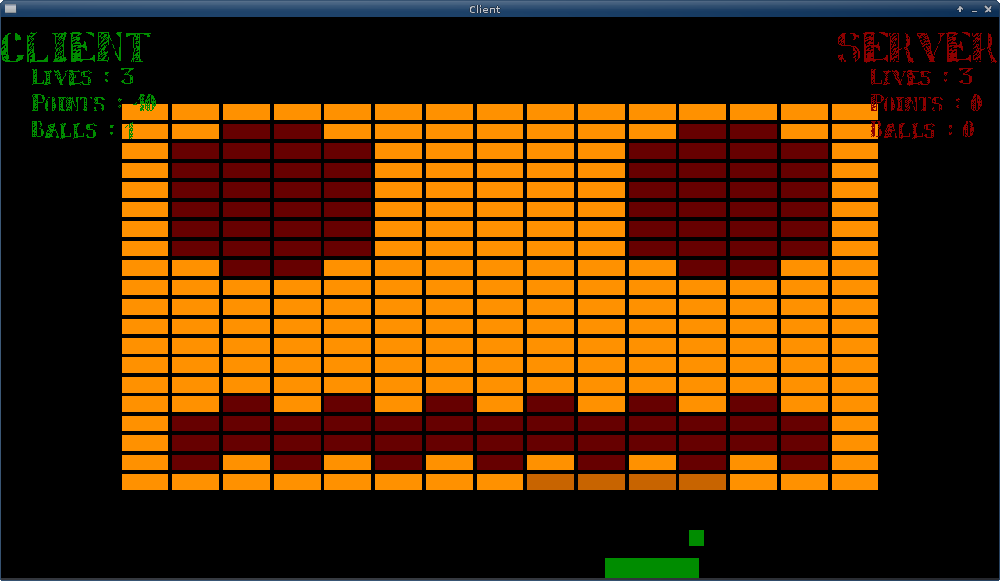

# DXBall
	A simple DX Ball clone using SDL 2


###3 Features:
	-Multiplayer
	-Configurable colours
	-Bonuses
	-Resizeable boards
	-Cross-platform ( Linux + Windows )

### Compiling:

## Linux
1. Crate a makefile based on DXBall.pro ( requires qmake )
2. Build the makefile using the command make
3. Based on command line options :
	`-r` run the program using command line ards in buildDXB.sh
	`-d` run the program with two cliens and server, making it possible to use multiplayer
	`-D` run the aboce in GDB
	`-g` run gdb also using the gdb and game args in buildDXB.sh
	`-v` run valgrind using the valgrind and game ars stated in buildDXB.sh

###This will enable almost all warnings available in clang++ except@
	`-Wno-c++98-compat` 		- C++98 compability is no concern for this project ( though I might add functionality to enable C++ 98 support later )
	`-Wno-c++98-compat-pedantic`	- C++98 compability is no concern for this project ( though I might add functionality to enable C++ 98 support later )
	`-Wno-switch-enum`		- This warning warns if you are not explicitly handling all possible enum values in a switch. SDL_Keycode contains more than 230 values.
	`-Wno-padded`		- Padding issues are not a concern at the moment.

All other warnings are handled and should be dealt with if possible

Can also be compiled with `g++` ( part of `gcc` ) with the same command excluding `-Weverything` and the `-Wno-**************` commands as these are not currently supported by `g++`.

###Valgrind :
	```valgrind --tool=memcheck --leak-check=full -suppressions=valgrind/ignore

This will run valgrind and check the program for any leaks. There should be none.

If you remove the last command ( `suppression=valgrind/ignore` ) you will get all "errors" from SDL, which probably isn't important to this game.

##Windows

Simply start the sln in msproj. It will require VS 2013 because of C++11 functionality.
